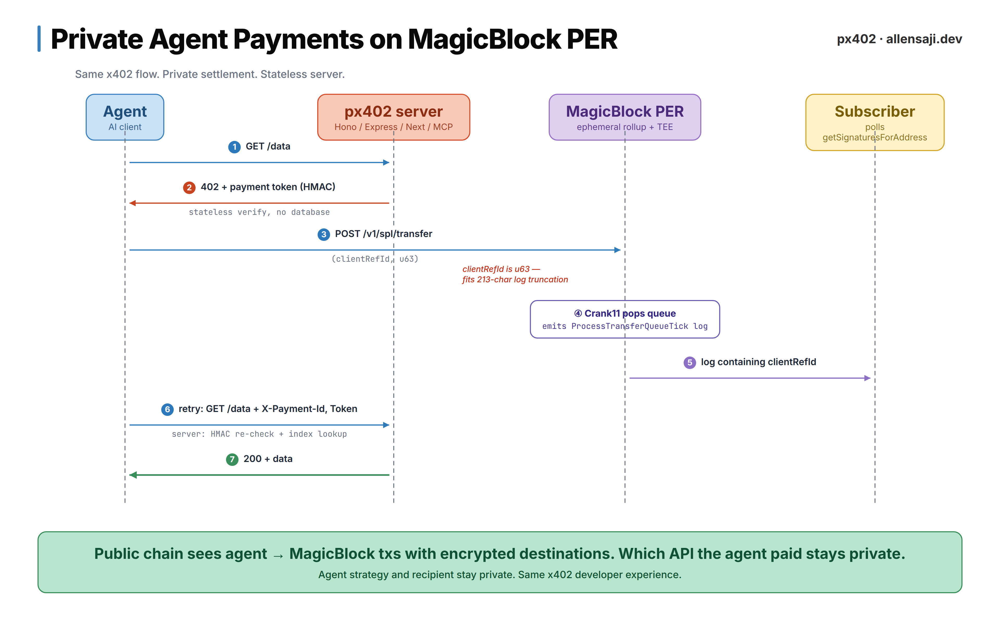

# px402

[](https://github.com/Allen-Saji/px402/actions/workflows/ci.yml)
[](./LICENSE)
[](./package.json)

Private-payment extension of the [x402](https://github.com/coinbase/x402) protocol. Agents pay for APIs with USDC on Solana, routed through MagicBlock's Private Ephemeral Rollups so the recipient (and therefore which API the agent consumed) stays hidden.

> **Pre-alpha · devnet-only.** 0.1.0 published to npm under [`@px402/*`](https://www.npmjs.com/org/px402). End-to-end verified on devnet. Mainnet target is sub-second round-trip but **unverified**. Devnet round-trip is bounded by MagicBlock's base-chain crank cadence (~4 min as of 2026-05-13). See [Limitations & roadmap](#limitations--roadmap).

## Quick start

```bash
# Server (Hono example — see packages/express + packages/next for adapters)
pnpm add @px402/hono @px402/core
```

```ts
import { Hono } from "hono";
import { px402 } from "@px402/hono";
import { PrivateTransferSubscriber, deriveQueuePda } from "@px402/core";

const SERVER_WALLET = "<your server wallet pubkey>";
const MINT = "<USDC mint>";
const VALIDATOR = "MAS1Dt9qreoRMQ14YQuhg8UTZMMzDdKhmkZMECCzk57";

const subscriber = new PrivateTransferSubscriber({
  rpcUrl: "https://rpc.magicblock.app/devnet",
  queuePda: deriveQueuePda(MINT, VALIDATOR).toBase58(),
  mint: MINT,
  receiverWallet: SERVER_WALLET,
});
await subscriber.start();

const app = new Hono();
app.use(px402({
  serverSecret: process.env.PX402_SERVER_SECRET!,
  paymentAddress: SERVER_WALLET,
  pricing: { "/api/sentiment": "10000" }, // 0.01 USDC
  subscriber,
}));
app.get("/api/sentiment", (c) => c.json({ signal: "bullish" }));
```

```ts
// Agent
import { Px402Client } from "@px402/client";

const client = new Px402Client({ wallet, mint });
const res = await client.fetch("https://your-server/api/sentiment?token=SOL");
const data = await res.json();
```

## How it works



**What's public on Solana:** the sender, the mint, the amount. **What's hidden:** the recipient. An outside observer cannot tell which API (or which service provider) the agent is paying. A settlement tx eventually lands the funds in the recipient's ATA on base chain, but the link from the agent tx to that settlement is broken by the TEE.

## Packages

| Package | Purpose | Status |
|---|---|---|
| `@px402/core` | HMAC tokens, crank log parsing, polling subscriber, PDA helpers, framework-agnostic `decide()` | shipped |
| `@px402/hono` | Hono middleware | shipped |
| `@px402/express` | Express middleware | shipped |
| `@px402/next` | Next.js App Router wrapper | shipped |
| `@px402/client` | `fetch` wrapper + `deposit` / `withdraw` / `balance` / `privateBalance` / `transfer` | shipped |
| `@px402/mcp` | MCP server (`px402_fetch`, `px402_balance`) | shipped |

Adopters install the adapter for their framework and the client separately.

## Protocol

### 402 response headers

| Header | Value |
|---|---|
| `X-Payment-Amount` | Micro-USDC as decimal string (e.g. `10000` = 0.01 USDC) |
| `X-Payment-Currency` | `USDC` |
| `X-Payment-Network` | `solana-per` |
| `X-Payment-Address` | Server **wallet** pubkey (not ATA). The API derives the correct ATA. |
| `X-Payment-Id` | Decimal u63. Echoed verbatim as `clientRefId` on the transfer. |
| `X-Payment-Token` | `v1.<base64url(payload)>.<base64url(hmac)>` — server-signed state so the server stays stateless across the pay-then-retry window. |

### Retry request

After paying, the client retries the original request with `X-Payment-Id` + `X-Payment-Token`. Possible responses:

| Status | Meaning |
|---|---|
| `200` | Verified. Response includes `X-Payment-Signature` (the settlement tx). |
| `402 payment_pending` | Agent's deposit is on-chain but the crank has not yet executed `ExecuteReadyQueuedTransfer` for it. Client retries. |
| `402 reason: "expired"` | Token TTL elapsed. Response carries a fresh `X-Payment-Id` + token; client pays again. |
| `401` | Token invalid (tampered, mismatched id/path/amount/destination). |
| `409 replay` | Same tx signature already consumed. |
| `429` | Rate limit exceeded (IP or per-wallet). |

### Payment transfer

The client posts this body to MagicBlock's `/v1/spl/transfer`:

```json
{
  "from":         "<agent wallet>",
  "to":           "<server wallet>",
  "amount":       10000,
  "mint":         "<USDC mint>",
  "cluster":      "devnet",
  "visibility":   "private",
  "fromBalance":  "base",
  "toBalance":    "base",
  "clientRefId":  "<paymentId from X-Payment-Id>"
}
```

The API returns an unsigned transaction. The client signs with the agent keypair and submits to the base RPC. From there the TEE takes over.

## Non-obvious behaviors, baked into the code

These are implementation-reality findings the original design doc does not cover. They're encoded in the shipped packages, but worth calling out:

1. **`visibility: private` on an `ephemeral→ephemeral` transfer is a no-op.** MagicBlock's SDK emits a bare SPL Transfer for that route against an undelegated PDA, so the tx fails on ER. The only private route that actually settles is `fromBalance: base, toBalance: base`. Client defaults reflect this.

2. **`X-Payment-Address` must be a wallet pubkey, not an ATA.** The REST API treats `to` as a wallet and derives the ATA itself. Passing an ATA causes it to derive an ATA-of-an-ATA, which doesn't exist on chain and the tx fails with `InvalidWritableAccount`.

3. **Memos don't survive the crank.** The memo instruction rides on the agent's base-chain deposit tx only. The crank emits a separate base-chain `ExecuteReadyQueuedTransfer` instruction whose program log carries `client_ref_id`. px402 uses `clientRefId` as the payment identifier end-to-end. Amount, sender, and receiver are recovered from `meta.preTokenBalances` / `meta.postTokenBalances` deltas on the same tx, filtered by mint.

4. **The subscriber polls; it does not subscribe.** `getSignaturesForAddress` on the base RPC with an `until` watermark, parallel `getTransaction` fetches in batches of 16. Three deterministic phases per chunk — parallel fetch, local parse, sorted apply — keyed on `(slot ASC, txOrder ASC)` so multi-tick chunks land in chronological order. `logsSubscribe` against MagicBlock ER accepted subscriptions but never delivered notifications, so WS was never wired in.

5. **The crank won't run unless someone kicks it.** Servers must call `GET /v1/spl/is-mint-initialized` at startup and on an interval. The endpoint registers the recurring base-chain `ExecuteReadyQueuedTransfer` crank for the queue PDA.

6. **ER commitment ordering is inverted.** `processed ≤ confirmed ≤ finalized` in slot number — opposite of mainnet, because ER has a single validator. The subscriber reads base (normal ordering); the inversion only matters for the parts of the client SDK that read ER (balance, send-to-ephemeral confirms).

7. **Watermark only advances after the chunk's apply phase succeeds.** Earlier code advanced the watermark immediately after the RPC call, which meant any failure during processing silently lost the affected sigs. The subscriber keeps the watermark put on chunk failure; the next poll re-fetches, and the per-sig `processedSigs` set (populated only after a definitive `getTransaction` result) prevents double-processing of the ones that did succeed.

8. **Stale blockhashes show up under load.** MagicBlock's REST API returns an unsigned transaction with a recent blockhash. Under devnet congestion the blockhash can expire before the client signs and submits. `Px402Client.transfer` retries up to 3× with fresh `postBuild` calls on `block height exceeded` / `Connect Timeout` / `fetch failed` / similar transient errors before surfacing them.

## Demo

The `apps/demo-apis` server exposes three priced routes backed by deterministic mock data:

| Route | Price | Purpose |
|---|---:|---|
| `/api/sentiment?token=SOL` | 0.01 USDC | bullish / bearish / neutral + confidence |
| `/api/whales?min=100000` | 0.02 USDC | recent large transfers |
| `/api/risk?address=…` | 0.03 USDC | wallet risk score + signal flags |

Run the demo locally:

```bash
pnpm install
cp apps/demo-apis/.env.example apps/demo-apis/.env
# edit .env to set PX402_PAYMENT_ADDRESS to your server wallet
pnpm --filter px402-demo-apis start &
pnpm --filter px402-example-agent start
```

The agent script loads a Solana keypair from `~/.config/solana/id.json` by default and calls `/api/sentiment` through `@px402/client`. Each call makes one base-chain payment; no pre-deposit or PER top-up.

## Development

```bash
pnpm install
pnpm build        # compile dist/ for each package (required before running integration tests)
pnpm test         # 73 vitest cases across all packages (no devnet, ~1s)
pnpm typecheck

# Real-devnet integration suite (10 scenarios, requires funded keypair at ~/.config/solana/id.json)
pnpm fund -- --count 30          # one-time wallet pool provisioning
pnpm test:devnet                 # full suite (~12 min total when run sequentially)

# Stress harness — configurable burst load
pnpm stress -- --agents 30 --rate 6 --duration 5
```

Devnet validation (post-2026-05-13 protocol change):
- Single payment round-trip is bounded by MagicBlock's base-chain crank cadence — currently ~4 minutes on devnet.
- Mainnet target is sub-second; not yet verified.
- See [Limitations & roadmap](#limitations--roadmap) for the crank-cadence caveat and the recommended client retry-window workaround.

## Limitations & roadmap

px402 0.1 is the production-ready first cut of the protocol: graceful shutdown, crash-safe watermark persistence, RFC 6585 rate limiting, observability hooks, and typed retry semantics for fund-moving operations. Everything below is **deliberately out of scope for 0.1** — open an issue if any of these block your adoption.

### Out of scope for 0.1

**Multi-tenant subscriber.** One `PrivateTransferSubscriber` listens on one `receiverWallet`. Multi-receiver indexing would add complexity (per-receiver `clientRefId` namespacing, per-tenant rate-limit buckets) that no current adopter needs. *Workaround:* one subscriber instance per tenant — overhead is small (bounded watermark + TTL index).

**Multi-RPC pool with health-checking.** The subscriber polls a single `rpcUrl`. On sustained outage, the `stalled` event fires after 30s and you redeploy with a new endpoint. Most production deploys front MagicBlock with Helius or Triton, which handle failover internally. *Workaround:* alert on `stalled`, persist the watermark, swap `rpcUrl` and redeploy — no payments dropped during the swap.

**Persisted in-flight verification state.** Crash-safe **watermark** persistence ships in 0.1, but the in-memory `clientRefId` index between `tick` and `verify` is not persisted. If the server crashes between receiving a tick and the agent retrying, that one payment resolves via backwards-scan after restart. The agent's retry budget + post-restart backfill covers normal crash windows. The right persistence shape (Redis-backed? SQLite?) depends on the adopter's stack — built-in would over-fit. *Workaround:* persist the watermark + accept that the rare sub-second-crash case triggers one extra retry.

**Devnet crank cadence vs default client retry window.** Since the 2026-05-13 protocol change, devnet crank latency has been observed to spike well past `@px402/client`'s default retry budget (~30s across 4 attempts). When that happens, the client throws `MaxRetriesExceededError` even though the subscriber later catches the tick correctly. Crank cadence is a MagicBlock-side knob; mainnet target is sub-second. *Workaround:* devnet adopters override `retryDelaysMs` — e.g. `[2000, 4000, 8000, 16000, 32000, 64000]`.

**`STALLED_THRESHOLD_MS` is a compile-time constant** (30s). `tokenTtlMs` is fully configurable; the stall threshold is not. Cheap to expose — open an issue if you need it.

### What ships in 0.1

For comparison — explicitly supported:

- Async graceful shutdown with `AbortController` drain (`subscriber.stop()`)
- Crash-safe watermark persistence via `onWatermarkAdvance` + `initialWatermark`
- `ready` / `tick` / `error` / `stalled` event hooks for Sentry / Datadog wiring
- RFC 6585 `Retry-After` on 429
- HMAC token rotation with `serverSecret: { current, previous }` overlap
- Typed `Px402DepositError` / `Px402WithdrawError` with `phase` + `partialSignature` for safe retry
- 1-hour soak harness in `scripts/soak.ts`
- Single-RPC failure model with a documented operator runbook (`docs/operations/`)

## License

Apache-2.0. See [LICENSE](./LICENSE) and [NOTICE](./NOTICE).
